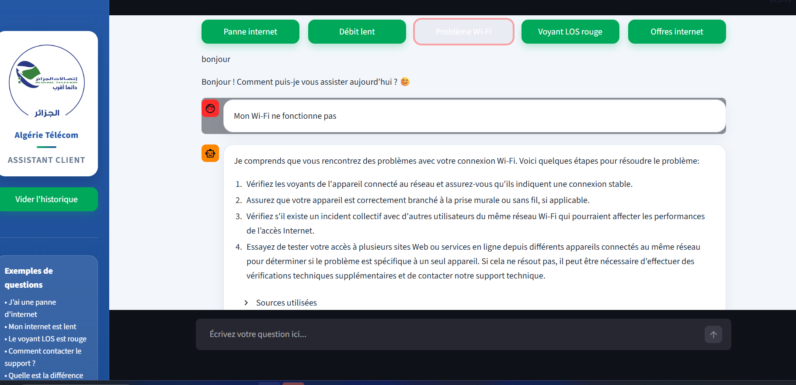

# Telecom Customer Support Chatbot

This project is an AI chatbot designed for telecom customer support.  
It is inspired by Algeria Telecom services and built as a personal portfolio project.

## Objective

The goal of this project is to help users get quick answers about telecom services, internet offers, connection problems, and customer assistance.

## Features

- Answer frequently asked customer questions
- Simple chatbot interface
- Intent classification
- NLP-based question understanding
- Dataset generation for chatbot training
- Modular Python project structure
- Can be extended with LLM and RAG

## Tech Stack

- Python
- NLP
- Machine Learning
- Scikit-learn
- Streamlit / UI module
- GitHub

## Project Structure

```text
telecom-customer-support-chatbot/
├── main.py
├── ui.py
├── intent_classifier.py
├── train_classifier.py
├── generate_dataset.py
├── requirements.txt
├── __init__.py
└── README.md
```

## How to Run

1. Clone the repository:

```bash
git clone https://github.com/younesdz03/telecom-customer-support-chatbot.git
```

2. Go to the project folder:

```bash
cd telecom-customer-support-chatbot
```

3. Install dependencies:

```bash
pip install -r requirements.txt
```

4. Run the project:

```bash
python main.py
```

## Project Status

This is a demo/portfolio version of the project.  
Sensitive files, API keys, private datasets, and production modules are not included.

## Future Improvements

- Add RAG with PDF documents
- Add LLM integration
- Add source citations
- Improve answer accuracy
- Deploy the chatbot online
- Add admin dashboard

## Screenshot



## Author

Developed by Younes Kherroubi.


